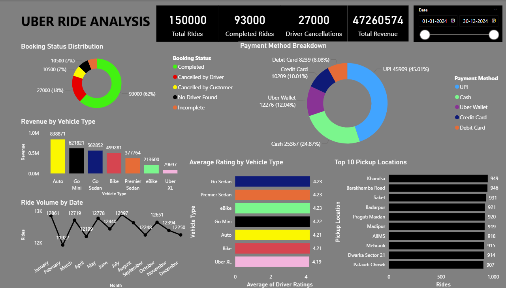

# 🚗 Uber Ride Analysis
Analysis of 150,000 Uber rides

## Tools Used
- Python | Power BI | Google Colab | SQL

## Key Insights
- 62% rides completed
- Auto top revenue vehicle (₹8.38L)
- UPI dominant payment (45%)

## Dashboard Preview

